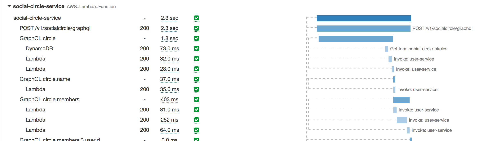

# GraphQL Middleware to add X-Ray tracing for resolvers

[](https://www.npmjs.com/package/@lifeomic/graphql-resolvers-xray-tracing)
[](https://greenkeeper.io/)
[](https://travis-ci.org/lifeomic/graphql-resolvers-xray-tracing)
[](https://coveralls.io/github/lifeomic/graphql-resolvers-xray-tracing?branch=master)

To enable X-Ray subsegment creation for GraphQL resolvers, add this package as a dependency of your project and use
code like this:

```javascript
const traceResolvers = require('@lifeomic/graphql-resolvers-xray-tracing');
const schema = makeExecutableSchema( ... );
traceResolvers(schema);
```

After enabling X-Ray tracing, you should see new subsegments in your X-Ray traces like this:



## Local Development

If you would like to run your GraphQL server without tracing the resolvers (such as during local development), you can use environment variables to conditionally wrap them.  For example, the AWS Lambda runtime injects the `AWS_LAMBDA_FUNCTION_NAME` which you can use so that the resolvers are only traced when running on Lambda:

```js
const traceResolvers = require('@lifeomic/graphql-resolvers-xray-tracing');
const schema = makeExecutableSchema( ... );
if (process.env.AWS_LAMBDA_FUNCTION_NAME) {
  traceResolvers(schema);
}
```

## AWS Segment Size Limitation
AWS has a 64K upload limit when submitting segements to AWS see [AWSXRay concepts segments](https://docs.aws.amazon.com/xray/latest/devguide/xray-concepts.html#xray-concepts-segments).  

If you try and submit more than this limit you will see the following aws error message 
    **"<date> [ERROR] Segment too large to send: {<traceinformation...}"**
  
One approach to remove this error, is to reduce the size of the batch upload (eg.. setStreamingThreshold(0) which will send each subsegment on close). See [Node - setStreamingThreshold](https://docs.aws.amazon.com/xray-sdk-for-nodejs/latest/reference/AWSXRay.html).  
